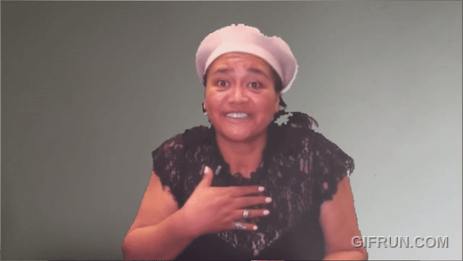
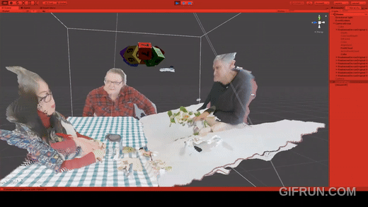
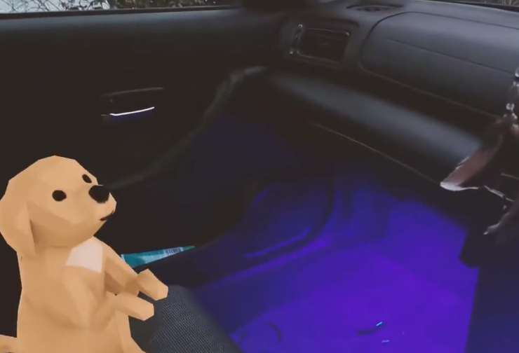

# CounterRacism

Volumetric playback to counteract racism -- the next iteration of [ComeToTable](https://github.com/prasanthsasikumar/ComeToTable) (SIGGRAPH ASIA 2019).

## Overview

CounterRacism extends the First Contact / ComeToTable project, using volumetric video capture and playback in augmented reality to foster intercultural relationship building. Recorded conversations with Indigenous Maori community members are played back as life-sized volumetric holograms seated across a dining table, creating an intimate face-to-face encounter designed to counteract racial discomfort.

Built with Unity, Microsoft Mixed Reality Toolkit (MRTK), and Depthkit volumetric capture.

## Video Capture & Playback Evolution

This project is part of a series exploring video capture and playback technologies across my PhD research. See the evolution here:

## Demo (2019)

## Publications

This work builds on and contributes to the following publications:

- **Come to the Table! Haere mai ki te tēpu!** -- Gunn, M., Bai, H., Sasikumar, P. SIGGRAPH Asia 2019 XR. [[DOI]](https://doi.org/10.1145/3355355.3361898)
- **First Contact - Take 2: Using XR to Overcome Intercultural Discomfort (racism)** -- Gunn, M., Sasikumar, P., Bai, H. ICAT-EGVE 2020. [[PDF]](https://diglib.eg.org/handle/10.2312/egve20201281)
- **First Contact - Take 2: Using XR technology as a bridge between Maori, Pakeha and people from other cultures in Aotearoa, New Zealand** -- Gunn, M., Billinghurst, M., Bai, H., Sasikumar, P. Virtual Creativity 11(1), 2021.
- **Spatial Perception Enhancement in Assembly Training Using Augmented Volumetric Playback** -- Sasikumar, P., Chittajallu, S., Raj, N., Bai, H., Billinghurst, M. Frontiers in Virtual Reality 2, 2021. [[DOI]](https://doi.org/10.3389/frvir.2021.698523)
- **haptic HONGI: Reflections on Collaboration in the Transdisciplinary Creation of an AR Artwork** -- Gunn, M., Campbell, A., Billinghurst, M., Lawn, W., Sasikumar, P., et al. Creating Digitally, 2023.
- **Haptic Hongi-Reiterated** -- Gunn, M., Sasikumar, P., Muthukumarana, S., Remana, T., Billinghurst, M. SIGGRAPH Asia 2023 XR. [[DOI]](https://doi.org/10.1145/3610549.3614609)

## Archive Notice

This repository is an archive of a Unity XR project developed during my PhD (2019-2024) at the Empathic Computing Lab, University of Auckland. Originally hosted on a private Gitea server, it is preserved here for reference, reproducibility, and future hardware-adapted recreation.

The project was built for Meta 2 AR headsets and may require updates for modern hardware (Meta Quest, Apple Vision Pro, HoloLens 2).

## Requirements

- Unity 2019.x (or compatible)
- Depthkit volumetric capture SDK
- Meta 2 AR headset (original target; adaptable to modern headsets)
- Intel RealSense D400 series cameras (for capture side)

## Credits

Built at the [Empathic Computing Lab](http://empathiccomputing.org/), University of Auckland.

- Depthkit by Scatter
- Microsoft Mixed Reality Toolkit (MRTK)
- ComeToTable predecessor project ([repo](https://github.com/prasanthsasikumar/ComeToTable))

## License

MIT
